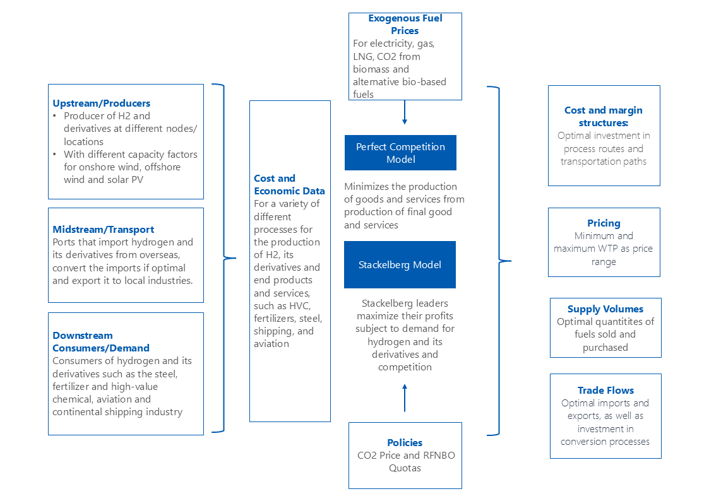
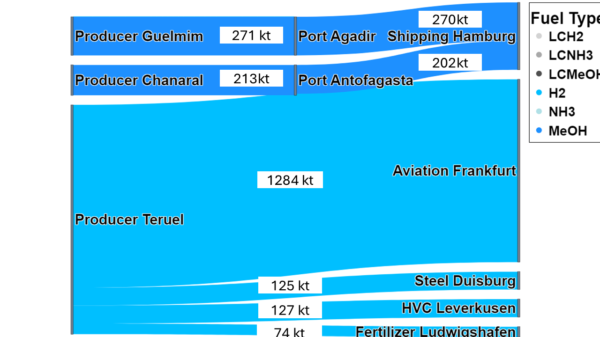
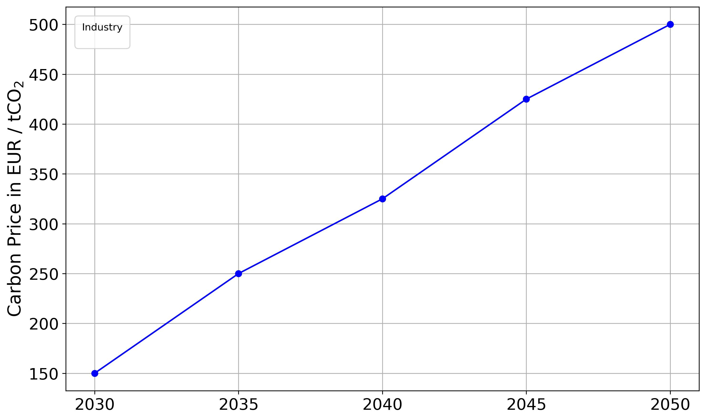
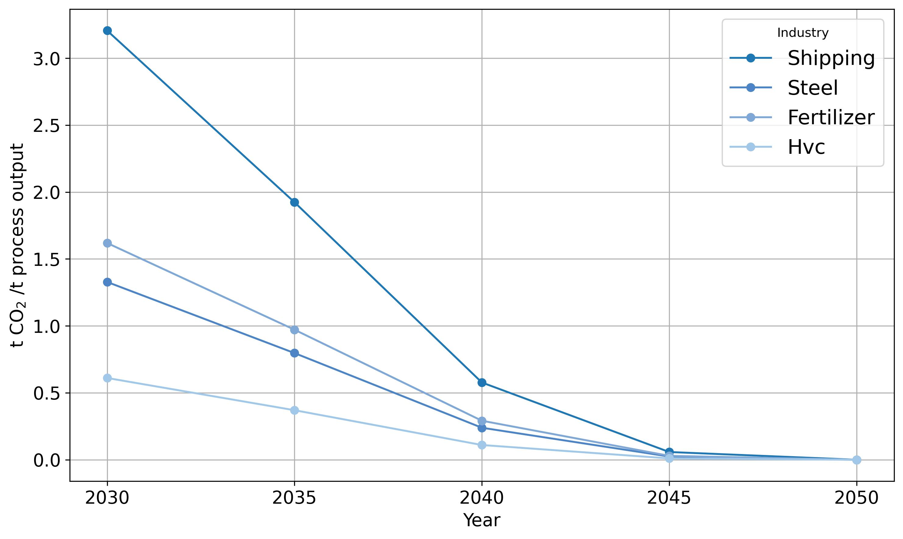
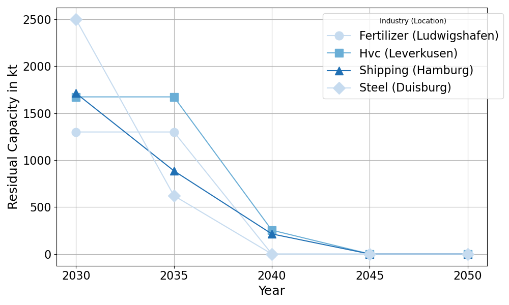
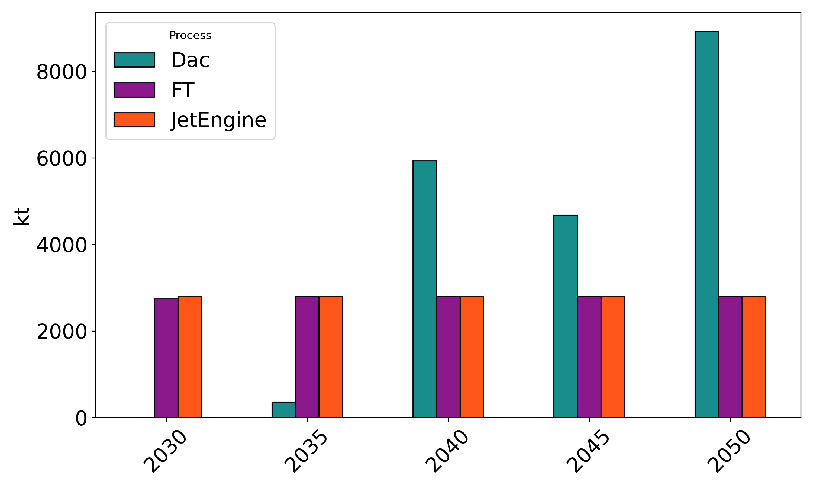
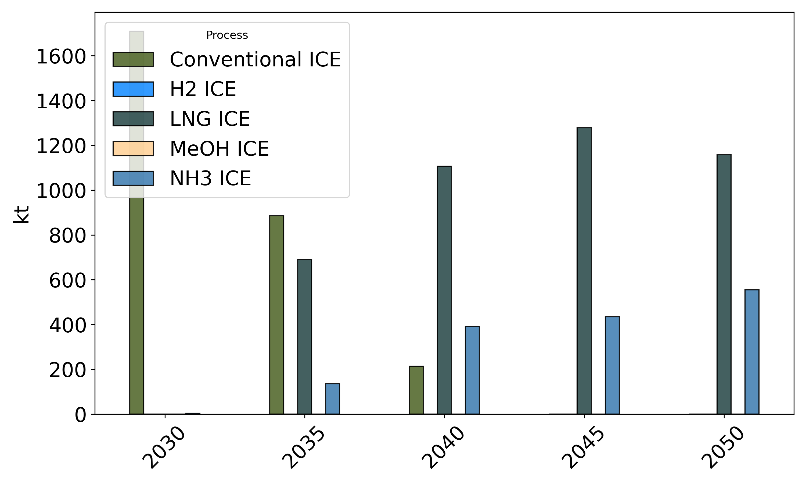

$readme = @'
# H2_Model

A Julia-based modeling toolkit to simulate hydrogen and e-fuel value chains. It supports:
- Perfect-competition market clearing (system cost minimization)
- A Stackelberg-like game where selected leaders maximize profit subject to demand and competition

This codebase accompanies the author's master thesis and includes model code and example plotting tools.

## What the model does
- Represents upstream producers (H2 and derivatives), midstream transport/conversion, and downstream industry demand (steel, fertilizer, high-value chemicals, shipping, aviation)
- Optimizes investment and operations across locations, processes, fuels, years, and modes
- Allows imports/exports via ports and simple network links (pipelines, shipping)
- Solves with Gurobi (recommended) or HiGHS

## Inputs (folder: data/)
Typical CSV/XLSX inputs read by _DataImport.jl and setup scripts:
- Mappings: process–industry, fuel–process, industry–location, output mapping
- Prices & policy: exogenous price paths (power, gas, LNG, CO2), RFNBO quotas
- Technology & costs: CAPEX/OPEX/FOM, residual capacities, lifetimes, maximum capacities
- Demand & emissions: sectoral demand, emissions factors/benchmarks
- Capacity factors: producers/electrolysers and generic capacity-factor tables
- Network/trade: pipeline and shipping distances/adjacency

Large or derived datasets should be tracked with Git LFS when appropriate.

## Repository layout
- Data/market setup: _DataImport.jl, _MarketSetUp.jl
- Core models: _Main.jl, Min_Cost_Mod.jl, BIG_M_Reformulation_*.jl, Bilevel_*.jl, CleanH2MinCostMod.jl
- Utilities: export_function.jl, helper_functions.jl
- Plotting (Python): results_plotting.py, Results_Plot.py, EU_ETS_viz.py

## Model modes
- Perfect competition: centralized system-cost minimization with market clearing; prices are duals.
- Stackelberg-like: selected leaders (e.g., steel, fertilizer) decide capacities/flows anticipating follower responses; implemented via bilevel reformulation (Big-M or similar).

## Getting started (Julia)
1) Open a Julia REPL in this folder and install dependencies once:
   using Pkg; Pkg.activate("."); Pkg.add(["JuMP","Gurobi","HiGHS","CSV","DataFrames","DataStructures","Revise","Plots","StatsPlots"])
2) Choose a model entry point (e.g., _Main.jl) and set the optimizer:
    set_optimizer(m, Gurobi.Optimizer)  # if licensed
    set_optimizer(m, HiGHS.Optimizer)   # open-source alternative
3) Run; results (CSV) are written to results/. Use the Python utilities to render figures to graphics/.

## Example results (illustrative)
Below are example figures generated from sample scenarios. Values depend on data/ inputs.

- Model scope and architecture

  

- Example trade network map

  

- RFNBO-constrained trade flows (2050), illustrative Sankey

  

  - CO2 price path and ETS benchmark convergence

  
  

  - Forecasted Residual capacities snapshot

  

- Aviation and Shipping process transitions (illustrative)

  
  

- Forecasted hydrogen trade-flows in 2030 (illustrative)
-   
## Notes
- Some prototype files include placeholders; refine incrementally
- Replace absolute Windows paths with project-relative paths for portability

## License
MIT (see LICENSE)
'@
