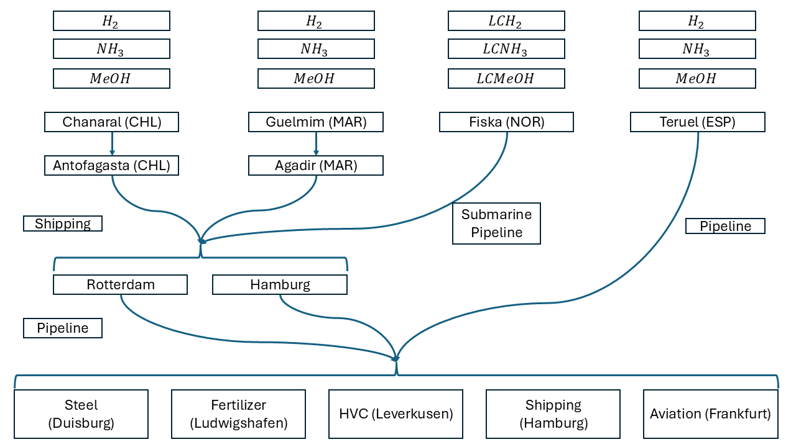
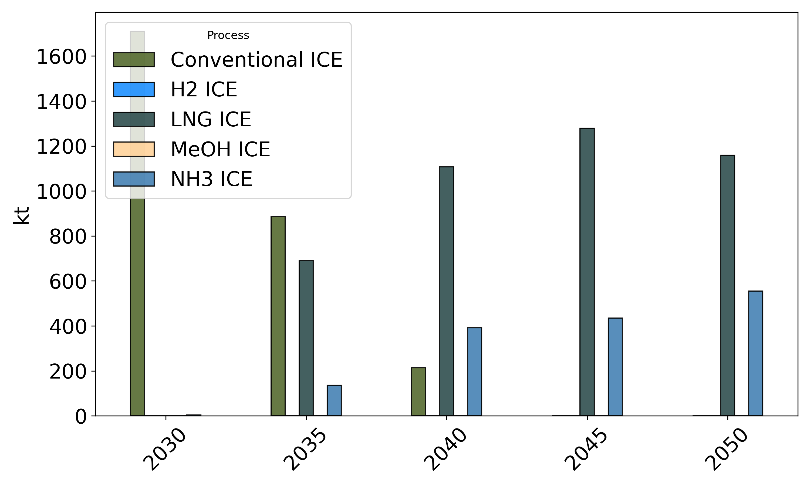
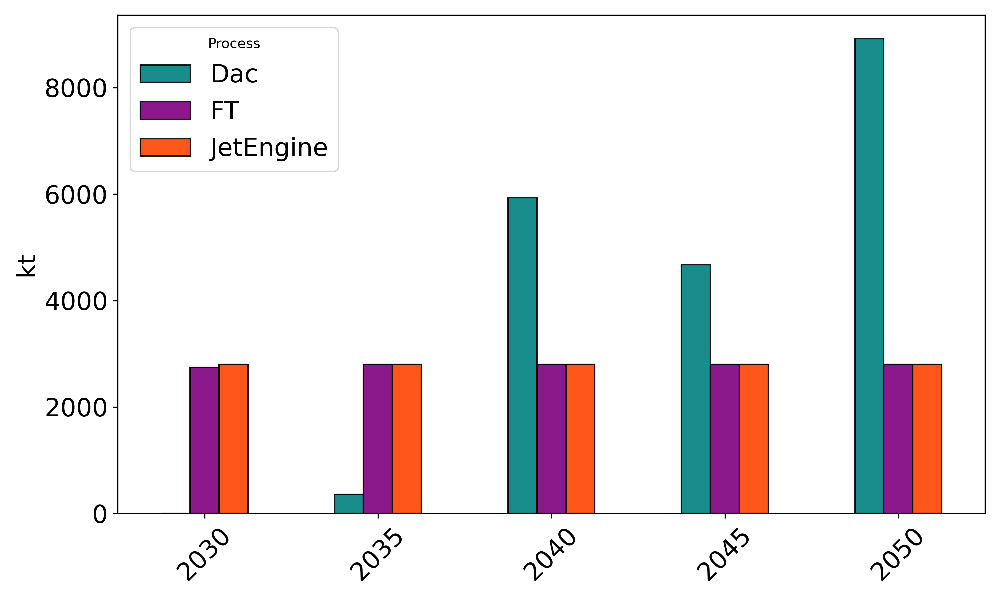

Set-Location -Path 'C:\Users\alex-\Desktop\H2_Modell\_code'

$section = @"

## Example results (illustrative)
Below are example figures generated from model outputs (see `results/`) and plotting utilities. Place the corresponding images under `graphics/` for the links to render on GitHub.

- Domestic H2 deliveries (Sankey): producer supplies HVC, Steel, and Fertilizer demand centers.
  
  

- Export chain (Sankey): multi-node path Producer → Port → Consumer, annotated with kt volumes per year.
  
  

- Shipping transition: conventional ICE declines while LNG/NH3-based options scale over time.
  
  

- Steel transition: Basic Oxygen Furnace (BOF) phases out; DRI ramps up in later years.
  
  

- Aviation demand stack (illustrative): DAC-based synthetic fuels and FT ramp towards 2050.
  
  

- CO2 price trajectory and ETS benchmarks: exogenous carbon price path and emissions intensity benchmarks converging to near-zero by 2050.
  
  
  
  

Notes
- Figures are illustrative; values depend on scenario inputs (price paths, technology costs, quotas) located in `data/`.
- Use the plotting scripts (`results_plotting.py`, `Results_Plot.py`, `EU_ETS_viz.py`) to regenerate visuals from fresh runs.
"@

Add-Content -Path 'README.md' -Value $section -Encoding UTF8

git add README.md
if ((git diff --cached --name-only) -ne $null) { git commit -m "docs: add example results gallery with figure slots" } else { Write-Host "No README changes to commit." }

git push -u origin main

