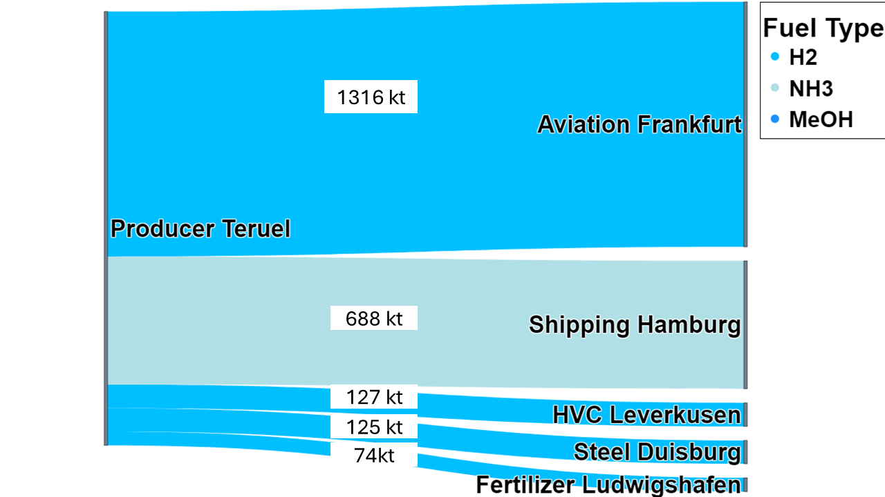

Set-Location -Path 'C:\Users\alex-\Desktop\H2_Modell\_code'

$section = @"

## Model scope and architecture

  

- Example trade network map

  

- RFNBO-constrained vs. unconstrained trade flows (2050)

  
  

- Sector process outputs (Stackelberg examples)

  
  

- Aviation and Shipping illustrative transitions

  
  

- CO2 price path and ETS benchmark convergence

  
  

- Residual capacities snapshot

  

